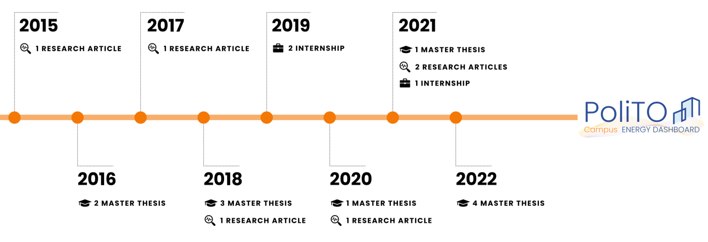

# Our Journey

* Silvio Brandi “Analysis of electrical energy consumptions of Politecnico di Torino through data analytics methods: the
  case of substation C” Rel. Alfonso Capozzoli, Giovanni Carioni, Marco Savino Piscitelli. Politecnico di Torino, Corso
  di laurea magistrale in Ingegneria Energetica E Nucleare, 2016
* Cristina Crosasso “Analisi dei consumi energetici reali attraverso lo strumento della firma energetica : il caso della
  sede del Castello del Valentino” Rel. Alfonso Capozzoli, Giovanni Carioni. Politecnico di Torino, Corso di laurea
  magistrale in Architettura Per Il Progetto Sostenibile, 2016 https://webthesis.biblio.polito.it/4799/
* Enrico Maria Pazè. Analisi energetica attraverso simulazione in regime dinamico di aule universitarie : il caso studio
  delle aule 27/27b/29/29b. Rel. Alfonso Capozzoli, Fabio Laguardia. Politecnico di Torino, Corso di laurea magistrale
  in Architettura Per Il Progetto Sostenibile, 2016
* Mariachiara Pinto. Analisi energetica di una centrale frigorifera del Politecnico di Torino attraverso analisi
  inversa. Rel. Alfonso Capozzoli, Marco Savino Piscitelli, Silvio Brandi, Vincenzo Maria Gentile. Politecnico di
  Torino, Corso di laurea magistrale in Ingegneria Edile, 2018
* Edoardo Chiabrera. Development of a tool for anomaly detection and power load forecasting: the case of Politecnico di
  Torino. Rel. Alfonso Capozzoli, Silvio Brandi. Politecnico di Torino, Corso di laurea magistrale in Ingegneria
  Energetica E Nucleare, 2018
* Roberto Chiosa. Detection and diagnosis of anomalous energy consumption patterns in buildings through a data analytics
  based approach: the case of Politecnico di Torino. Rel. Alfonso Capozzoli, Marco Savino Piscitelli. Politecnico di
  Torino, Corso di laurea magistrale in Ingegneria Energetica E Nucleare, 2020
* Simone Deho'. Application of data analytics processes for the detection of anomalous energy patterns in buildings.
  Rel. Alfonso Capozzoli, Marco Savino Piscitelli, Roberto Chiosa. Politecnico di Torino, Corso di laurea magistrale in
  Ingegneria Energetica E Nucleare, 2021
* Simone Vitale. AUTOMATED ANOMALY DETECTION IN ENERGY CONSUMPTION TIME SERIES OF BUILDINGS THROUGH PATTERN RECOGNITION
  TECHNIQUES. Rel. Alfonso Capozzoli, Marco Savino Piscitelli, Roberto Chiosa. Politecnico di Torino, Corso di laurea
  magistrale in Ingegneria Energetica E Nucleare, 2022
* Maria Teresa Zitelli. Application of Data Analytics techniques for the analysis of building energy performance during
  operation : the case of Politecnico di Torino. Rel. Alfonso Capozzoli, Marco Savino Piscitelli. Politecnico di Torino,
  Corso di laurea magistrale in Ingegneria Energetica E Nucleare, 2022
* Davide Taddei. A cloud-based Energy Information System (EIS) for innovative energy management in buildings: the case
  of Politecnico di Torino. Rel. Alfonso Capozzoli, Fulvio Giovanni Ottavio Risso, Roberto Chiosa, Marco Savino
  Piscitelli. Politecnico di Torino, Corso di laurea magistrale in Ingegneria Informatica (Computer Engineering), 2022
* Chiosa, R., Piscitelli, M. S., Fan, C., & Capozzoli, A. (2022). Towards a self-tuned data analytics-based process for
  an automatic context-aware detection and diagnosis of anomalies in building energy consumption timeseries. Energy and
  Buildings, 270, 112302. https://doi.org/10.1016/j.enbuild.2022.112302
* Chiosa, R.; Piscitelli, M.S.; Capozzoli, A. (2021) A Data Analytics-Based Energy Information System (EIS) Tool to
  Perform Meter-Level Anomaly Detection and Diagnosis in Buildings. Energies, 14,
  237. https://doi.org/10.3390/en14010237
* Piscitelli, M.S., Brandi, S., Capozzoli, A. et al. (2021) A data analytics-based tool for the detection and diagnosis
  of anomalous daily energy patterns in buildings. Build. Simul. 14, 131–147 . https://doi.org/10.1007/s12273-020-0650-1
* Capozzoli, A., Piscitelli, M. S., Brandi, S., Grassi, D., & Chicco, G. (2018). Automated load pattern learning and
  anomaly detection for enhancing energy management in smart buildings. Energy, 157, 336-352.
* Capozzoli, Alfonso & Piscitelli, Marco & Brandi, Silvio. (2017). Mining typical load profiles in buildings to support
  energy management in the smart city context. Energy Procedia. 134. 865-874. 10.1016/j.egypro.2017.09.545
